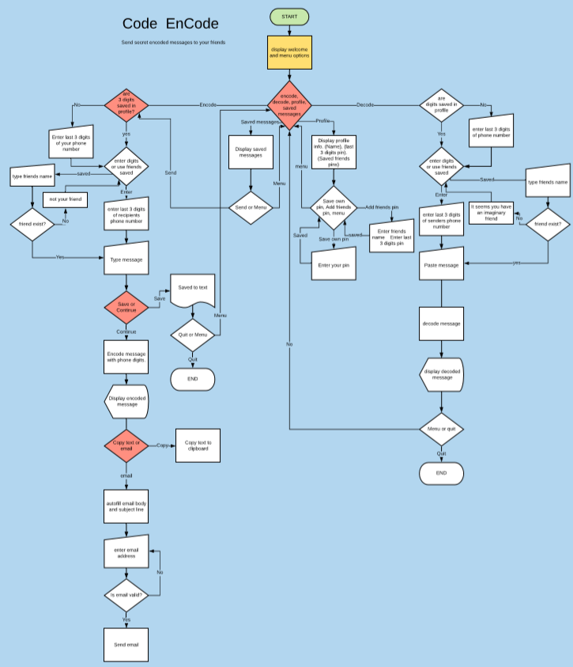

# Software Development Plan 
## Statement of scope and purpose.
### What it does...
Code EnCode is an application for encoding messages. It allows for a secret exchange of encoded texts between friends without the need for a private or encrypted platform. Encoded messages are intended to be sent through email. Code EnCode uses a combination of the last 3 digits of your phone number and the last 3 digits of the recipients phone number to encode you message. Messages are decoded by providing the same information. 
### The problem..
Often the contents of our messages are personal or intended for just one person.
Regular encryption often involves relying on both parties using keys or passwords. This app will allow encoded communication between these parties without the need to remember passwords.

 ### Target Audience
 *Our users are highly paranoid conspiracy theorists and in the event of a government instigated zombie apocalypse a secure yet simple encoded messaging system for our simple minded users is a must.* 

--------------------------------------------------------------
### How the target audience will use the application
Our slightly unhinged users will run the application from their bunkers between bouts of flu and measles, unless they have been vaccinated, in which case they will not use the application, having already become docile and compliant.

Our users enter the last 3 digits of their phone number followed by the last 3 digits of the recipients phone number. 
They are then prompted to enter a message. 
Once the message is completed the digits entered will be used to encode the text making it unreadable.
The user then sends the message to their intended recipient who will use the app to decode the message.
- Users will not be required to enter their entire phone number. 
- Users can save profile information using an alias or first name.
- Users can save profile information of receivers for quicker encoding and decoding.
- Our target audience is undecided on having inbuilt mail functionality. If google mail is used it may be necessary to install an evilometer to detect current level of google evilness. 
######          SHHHH... Yes, once they were the good guys but then they grew. Every large faceless company is evil

--------------------------------------------------------------

### ***The lack of fast internet will make voice or video communication untenable. Standard encryption was all created by government for eavesdropping and is communicated to agents worldwide via contrails. This only leaves Code EnCode. The one remaining pure encoding app.***

--------------------------------------------------------------

## Features
 * Create user profile

            Save name and last 3 digits of phone number to a user profile.
            This is saved to a .csv file which can be accessed by the app to bypass the need for the user to enter their last 3 phone digits each time they wish to encode.
            This is achieved through the use of  if else statement and a method to check the csv file for saved profile information. 
            
 * Create recipient profiles

              Save name and last 3 digits of friends phone numbers.
              This is saved to a .csv file which can be accessed by the app to build a menu of recipients when encoding a message.
              This is achieved by pulling data from the csv file and using the gem tty prompt to build a menu from the csv fields converted into an array or arrays.

 * Encode Message

        Encode a block of text by running the sender and receivers 3 digits and the sender message through an encoding algorithm.
        The decoder builds an array of characters. 
        It then adds the users last 3 phone digits to offset the index value of each letter in the users message. This returns a different index value, hence a different character. The same process is applied to create a second layer of encoding using the recipients 3 digits.
        Error checking is used to rescue the app and prevent an error if invalid characters are used.

 * Decode Message

              Decode a block of text by running the sender and receivers 3 digits plus the sender message through an Decoding algorithm.
              The decoder reverses the operations from the encoder. 
        It takes the sender and recipient last 3 digits, and substracts the value from the index of characters. 

 * Share encoded message

        Copy and paste.

 * Destroy all Evidence 

        Reset to default deleting all user saved information.
        (Warning, Permanently deletes, utilizing magnetic mind waves to prevent recovery)

## User interaction and experience.

The user can consult the included help file to discover how to fully use each feature.
The main menu shows a list of features with prompts on use. 
Menu options are:
  - Encode 
  - Decode
  - Profile
  - Saved messages

  Each feature presents the user with prompts for input.

  Encode: 
  - Checks for user profile. 
  - If profile is not saved, User will be prompted to enter last 3 phone digits. 
  - User will be prompted to enter last 3 digits of recipients phone number.
  - User will be prompted to type message for encoding.
  - Error check for invalid characters. Recue: Remove invalid characters and continue with encode
  - Encoded message will be displayed for copying
  - Main menu is displayed

  Decode:
  - User will be prompted to enter last 3 phone digits. 
  - User will be prompted to enter last 3 digits of senders phone number.
  - User will be prompted to paste message for encoding.
   Error check for invalid characters. Recue: Remove invalid characters and continue with Decode
  - Decoded message will be displayed.
  - Main menu is displayed

  Profile:
   - User name and digits will be displayed.
   - Option to change name and digits is displayed
   - Friends list is displayed.
   - option to return to main menu

   Saved messages: 
   - Saved message list is displayed
   - Saved message can be copied for encoding/decoding
   - option to return to main menu
   

  ## Control flow Diagram

  

## Implementation Plan

The intention is to implement features in the following order:
1. Loading screen
2. Main Menu
3. Encode methods
4. Decode methods
5. Profile methods
-------------------
1. Loading Screen - Time required - 2-3 hours.
- Use TTY Progressbar to create an interesting loading animation that sets a fun / upbeat mood for the theme of the app. 
- Create seperate loading.rb for cleaner implementation.

2. Main Menu - Time required - 3 hours - It will need to be updated as features are added throughout the project. 
- Code the Main menu as user input to begin with. 
- Then update code to use tty prompt for a nicer interface.
- Use conditional statements and loops to pull information from profile, decode and encode methods to create a better user experience.

3. Encode methods - Time required - ~~10 hours~~ 25 hours.
Create a method to encode text using last 3 digits of phone number.
- Build array from alphabet characters and use array.index to return a value for each character. 
- Offset the index with user phone digits and output the new character. This creates an encoded text. 
- Save the encoded text with the receivers phone number as an additional security check.

4. Decode methods - Time required 1-2 hours 
Reverse the Encode method to create the decode method. This is achieved by reusing the majority of the encode method, but reversing the order of  
- phone digit input and.. 
- subtracting the phone digit offset from the..
- array.index.

5. **Profile Methods - Time Required ~~3-4 hours~~ 10 hours**
Write a method for creating and editing user profile information.
Profile should include 
- name, 
- user last 3 phone digits 
- friends list.

Create a method for checking if a user profile exists: 
- Add a field to the csv file while creating a user profile. This allows the use of an if statement or while loop to control app flow to encode and decode methods.
- Create method for saving recipient details to the profile csv. Each - Recipients name and phone digits should be saved to a row in a csv file.

6. **Improve user experience with additional gems - Time Required - 12 hours.**
 - Use catpix or rmcagick to add image logo and themed graphics.
 - Use colorize to increase vibrance and interest for text and menu options.
 - add in app emailing through pony gem or add messaging gem
 - find gem to animate the encode/decode output or write method to animate the encode/decode output (cycle through random letter combinations before settling on correct decode)
